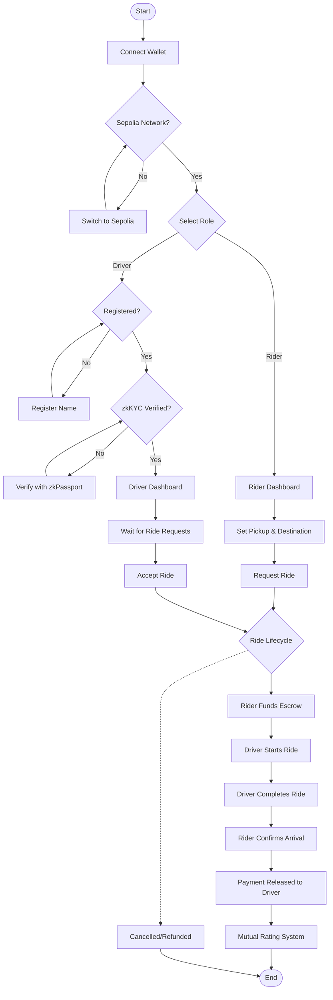
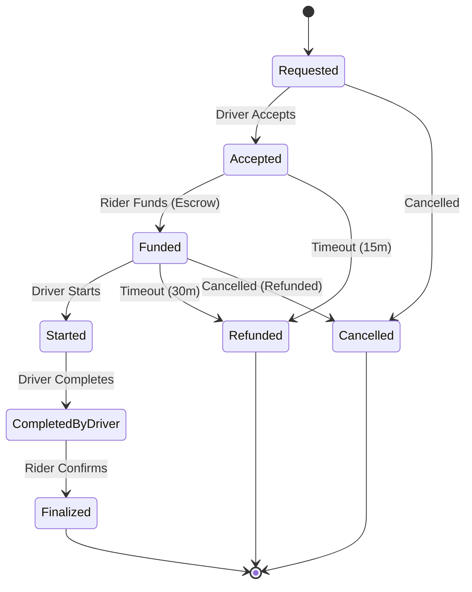
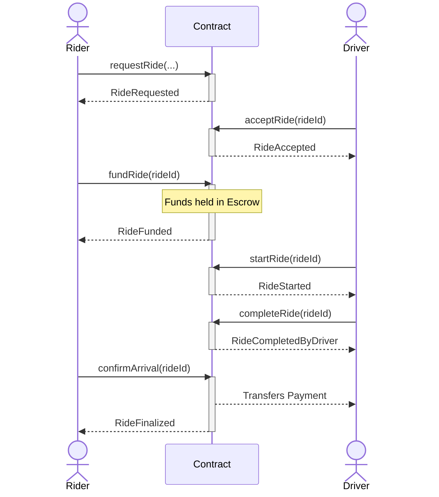

# Decentralized Ride-Sharing DApp

A decentralized ride-sharing application built on Ethereum with smart contract escrow functionality, driver registry, rating system, and timeout protections. The frontend uses intelligent state-aware modules to guide user actions.

## Tech Stack

- **Smart Contracts**: Solidity 0.8.28, Foundry
- **Frontend**: Next.js 16, React 19, TypeScript, Tailwind CSS 4
- **Web3**: viem 2.x, wagmi connectors
- **Network**: Ethereum Sepolia Testnet
- **Design**: Minimalist Black & White (Uber-inspired)

## Project Structure

```
ride-sharing/
├── contracts/                    # Foundry smart contracts
│   ├── src/
│   │   └── RideSharing.sol      # Main contract with state machine
│   ├── test/
│   │   └── RideSharing.t.sol    # 37 comprehensive tests
│   ├── script/
│   │   └── Deploy.s.sol         # Deployment script
│   └── foundry.toml             # Foundry configuration
│
└── frontend/                     # Next.js 16 application
    ├── app/
    │   ├── contracts/
    │   │   ├── types.ts         # TypeScript interfaces
    │   │   └── abi.ts           # Contract ABI & constants
    │   ├── copilot/             # Intelligent logic modules
    │   │   ├── stateResolver.ts # Determines ride state & user role
    │   │   ├── actionPolicy.ts  # Action permission logic
    │   │   ├── gasEstimator.ts  # Gas cost estimation
    │   │   └── timeoutMonitor.ts # Timeout tracking & countdowns
    │   ├── hooks/
    │   │   ├── useWeb3.ts       # Wallet connection & clients
    │   │   └── useContract.ts   # Contract interaction hooks
    │   ├── components/          # Reusable UI components
    │   ├── globals.css          # Uber-inspired design system
    │   ├── layout.tsx
    │   └── page.tsx             # Main application page
    └── package.json
```

## Application Flow

The following diagram illustrates the complete user journey from wallet connection to ride finalization, including driver registration and the zkKYC verification process.



## Smart Contract Overview

### RideSharing.sol

The core smart contract implements a state machine for ride lifecycle management with secure escrow, driver reputation, and timeout protections.

#### State Machine



#### Interaction Flow



#### States

| State               | Value | Description                                            |
| ------------------- | ----- | ------------------------------------------------------ |
| `Requested`         | 0     | Ride requested by rider, waiting for driver            |
| `Accepted`          | 1     | Driver accepted, waiting for funding                   |
| `Funded`            | 2     | Funds in escrow, waiting for ride start                |
| `Started`           | 3     | Ride in progress                                       |
| `CompletedByDriver` | 4     | Driver marked complete, waiting for rider confirmation |
| `Finalized`         | 5     | Ride complete, payment released                        |
| `Cancelled`         | 6     | Ride cancelled (refunded if not started)               |
| `Refunded`          | 7     | Timeout refund processed                               |

#### Key Features

- **Escrow System**: Funds held securely until ride finalization
- **Driver Registry**: Drivers register with name and build reputation
- **Identity Verification**: Privacy-preserving driver verification using zkKYC (zkPassport)
- **Rating System**: 1-5 star ratings (both rider and driver) after finalization
- **Timeout Protection**: Auto-refund if funding/start deadlines exceeded
- **State Transitions**: Modifiers enforce valid state changes
- **Event Logging**: All actions emit events for frontend indexing

#### Timeout Constants

| Constant         | Duration   | Trigger                         |
| ---------------- | ---------- | ------------------------------- |
| `ACCEPT_TIMEOUT` | 15 minutes | Must fund after acceptance      |
| `START_TIMEOUT`  | 30 minutes | Driver must start after funding |

#### Contract Functions

| Function                         | Caller            | Description                           |
| -------------------------------- | ----------------- | ------------------------------------- |
| `registerDriver(string)`         | Anyone            | Register as driver with name          |
| `requestRide(...)`               | Rider             | Create a new ride request             |
| `acceptRide(uint256)`            | Registered Driver | Accept a requested ride               |
| `fundRide(uint256)`              | Rider             | Deposit fare into escrow              |
| `startRide(uint256)`             | Driver            | Mark ride as started                  |
| `completeRide(uint256)`          | Driver            | Mark ride as completed                |
| `confirmArrival(uint256)`        | Rider             | Confirm and release payment           |
| `cancelRide(uint256, string)`    | Rider/Driver      | Cancel ride                           |
| `rateDriver(uint256, uint8)`     | Rider             | Rate driver (1-5, after finalization) |
| `rateRider(uint256, uint8)`      | Driver            | Rate rider (1-5, after finalization)  |
| `claimRefundNotFunded(uint256)`  | Rider             | Claim timeout refund (accept -> fund) |
| `claimRefundNotStarted(uint256)` | Driver            | Claim timeout refund (fund -> start)  |

#### View Functions

| Function                   | Returns                             |
| -------------------------- | ----------------------------------- |
| `getRide(uint256)`         | Full ride details                   |
| `getDriver(address)`       | Driver registration & rating info   |
| `getRideRating(uint256)`   | Rating info for a ride              |
| `getRefundStatus(uint256)` | Refund eligibility & time remaining |
| `getRiderRides(address)`   | All ride IDs for a rider            |
| `getDriverRides(address)`  | All ride IDs for a driver           |
| `getRegisteredDrivers()`   | List of all registered drivers      |

## Frontend Architecture

The frontend uses **Intelligent Context Modules** to guide users through the ride flow by understanding context, state, and permissions.

### Core Logic Modules

#### 1. Identity Verification (zkKYC)

The system simulates a **zkPassport** integration for driver verification. In a production environment, this ensures drivers are verified humans without revealing sensitive personal data on-chain.

- **Function**: `verifyIdentity()`
- **Mechanism**: Checks for valid registration and sets `isVerified` status. Future versions will verify Zero-Knowledge Proofs generated from passport data.

#### 2. State Resolver (`stateResolver.ts`)

Determines the current ride state and user's role:

```typescript
interface ResolvedState {
  state: State; // Current contract state
  stateLabel: string; // Human-readable label
  userRole: UserRole; // "rider" | "driver" | "stranger"
  canCancel: boolean;
  canFund: boolean;
  canStart: boolean;
  canComplete: boolean;
  canConfirm: boolean;
  canRateDriver: boolean;
  canRateRider: boolean;
  nextAction: string; // Contextual guidance
}
```

#### 2. Action Policy (`actionPolicy.ts`)

Validates whether an action can be performed based on state, role, and conditions:

```typescript
interface PolicyResult {
  allowed: boolean;
  reason: string; // Why allowed/blocked
}
```

#### 3. Gas Estimator (`gasEstimator.ts`)

Estimates transaction costs before execution:

```typescript
interface GasEstimate {
  gasLimit: bigint;
  gasPrice: bigint;
  ethCost: string; // "0.000123"
  usdCost: string; // "0.37"
}
```

#### 4. Timeout Monitor (`timeoutMonitor.ts`)

Tracks countdowns for funding and start deadlines:

```typescript
interface TimeoutStatus {
  type: "accept" | "start" | "none";
  elapsedSeconds: number;
  remainingSeconds: number;
  isExpired: boolean;
  canClaimRefund: boolean;
}
```

### React Hooks

#### `useWeb3()`

Manages wallet connection:

```typescript
const {
  address, // Connected address
  balance, // ETH balance
  isConnected,
  chainId,
  connect,
  disconnect,
} = useWeb3();
```

#### `useContract()`

Provides all contract interaction methods:

```typescript
const {
  rideCounter,
  isRegisteredDriver,
  driverRating,
  registerDriver,
  requestRide,
  acceptRide,
  fundRide,
  startRide,
  completeRide,
  confirmArrival,
  cancelRide,
  rateDriver,
  rateRider,
  claimRefundNotFunded,
  claimRefundNotStarted,
  getRide,
  // ...
} = useContract();
```

## Getting Started

### Prerequisites

- Node.js 20+
- Foundry (`forge`, `cast`, `anvil`)
- MetaMask or compatible wallet

### Installation

```bash
# Install frontend dependencies
cd frontend
npm install

# Install Foundry dependencies
cd ../contracts
forge install
```

### Configuration

Update the contract address in `frontend/app/hooks/useWeb3.ts`:

```typescript
export const CONTRACT_ADDRESS =
  "0x764b5563DdF36A507354C06fCA3b91A16f3bcb92" as Address; // Your deployed address
```

### Running Tests

```bash
# Contract tests (37 tests)
cd contracts
forge test -vvv

# Test coverage
forge coverage
```

### Development

```bash
# Terminal 1: Start local Anvil node
cd contracts
anvil

# Terminal 2: Deploy contract locally
forge create \
  --rpc-url http://localhost:8545 \
  --private-key 0xac0974bec39a17e36ba4a6b4d238ff944bacb478cbed5efcae784d7bf4f2ff80 \
  src/RideSharing.sol:RideSharing

# Terminal 3: Start frontend
cd frontend
npm run dev
# Visit http://localhost:3000
```

### Build for Production

```bash
cd frontend
npm run build
npm start
```

## Design System

The frontend uses an Uber-inspired minimalist design:

### Colors

| Usage      | Color      | CSS       |
| ---------- | ---------- | --------- |
| Primary    | Black      | `#000000` |
| Background | Off-white  | `#F5F5F5` |
| Card       | White      | `#FFFFFF` |
| Border     | Light gray | `#E0E0E0` |
| Muted text | Gray       | `#666666` |

### Typography

- **Font Family**: System sans-serif (San Francisco, Segoe UI, Roboto)
- **Tracking**: Tight (`-0.01em`)
- **Smoothing**: Antialiased

### Component Patterns

- **Cards**: White background, subtle border, rounded corners
- **Buttons**: Black primary, white secondary with black border
- **Inputs**: Minimal border, focus ring on active
- **States**: Color-coded (green=success, red=error, yellow=warning)

## Contract Deployment

### Deploy to Sepolia

```bash
cd contracts

forge create \
  --rpc-url $SEPOLIA_RPC_URL \
  --private-key $PRIVATE_KEY \
  --verify \
  --constructor-args \
  src/RideSharing.sol:RideSharing
```

### Verify on Etherscan

```bash
forge verify-contract \
  <CONTRACT_ADDRESS> \
  src/RideSharing.sol:RideSharing \
  --watch \
  --etherscan-api-key $ETHERSCAN_API_KEY
```

### Environment Variables

```bash
# .env.local in frontend directory
NEXT_PUBLIC_CHAIN_ID=11155111
NEXT_PUBLIC_CONTRACT_ADDRESS=0x...
```

## Smart Contract Security

- **Escrow Protection**: Funds only released on mutual confirmation
- **Timeout Refunds**: Automatic refund if deadlines missed
- **State Validation**: All transitions verified by modifiers
- **Access Control**: Role-based function permissions
- **Reentrancy Protection**: NonReentrant modifier on payment functions

## License

MIT
